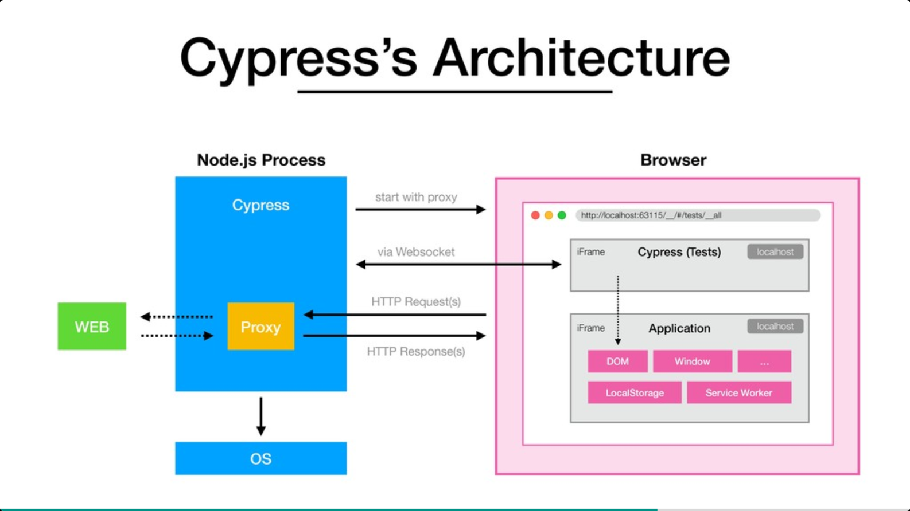
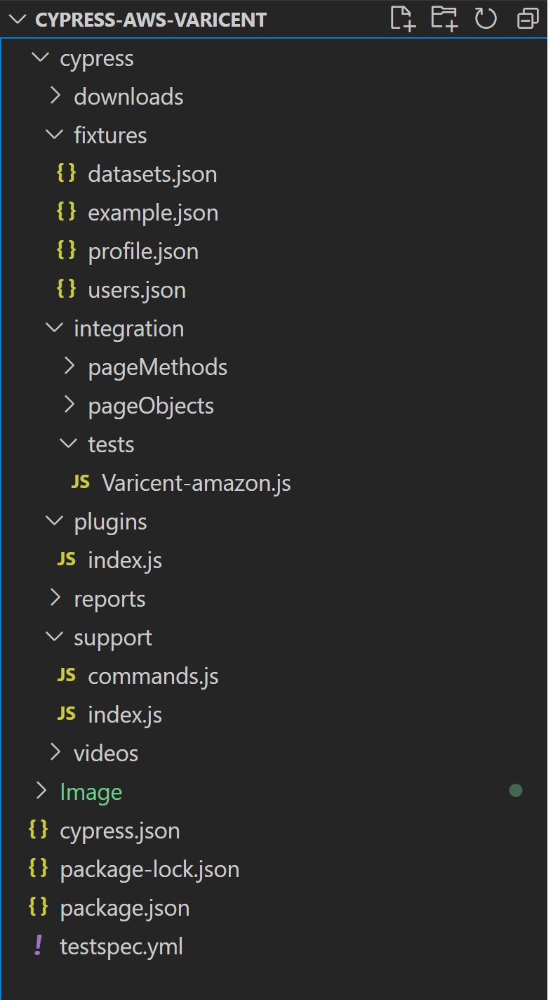
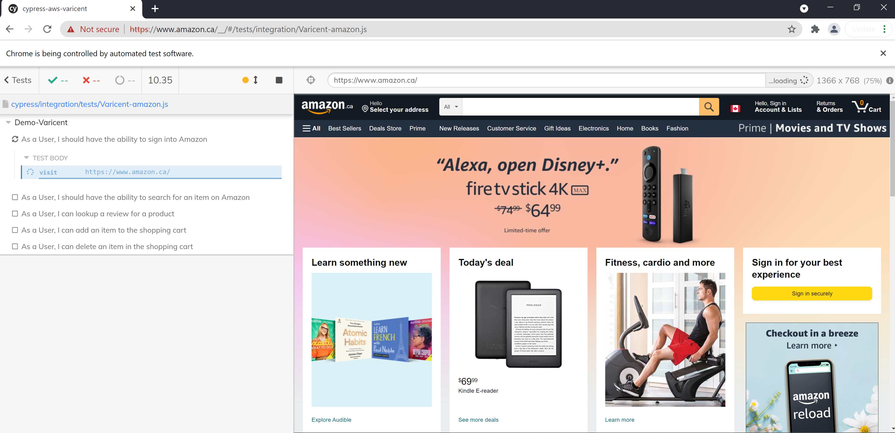
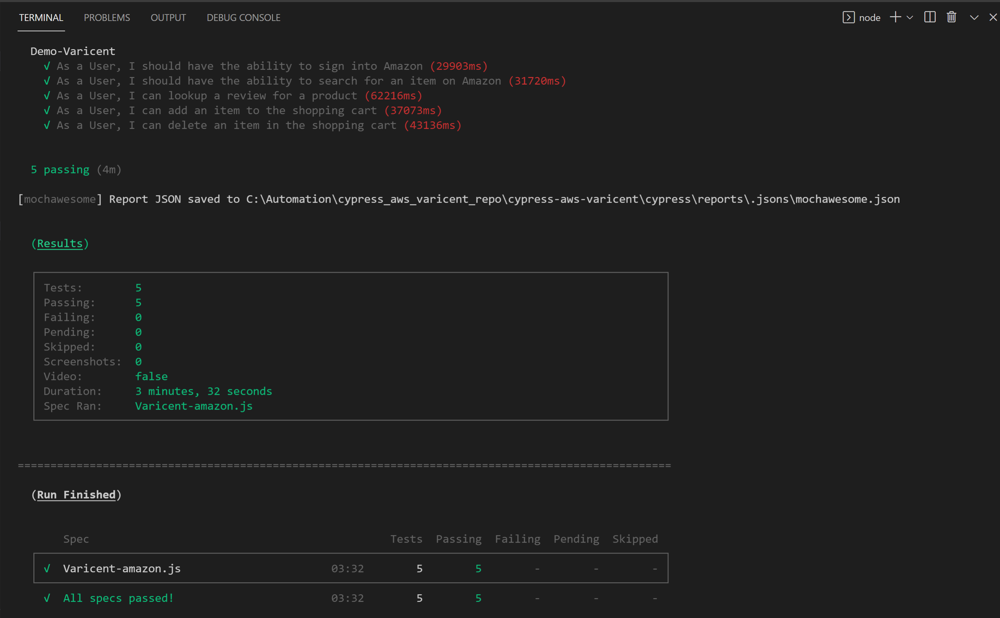
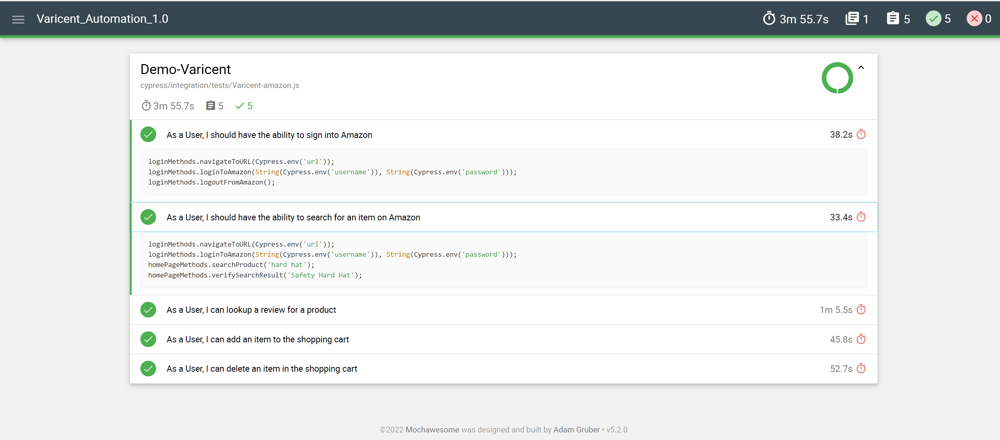
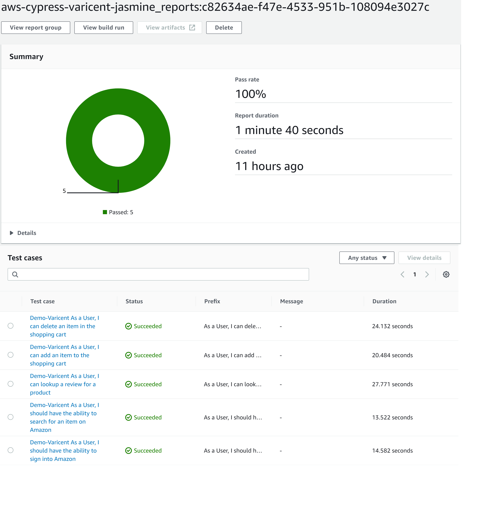

<p align="center">

</p>

# Behavior & Test Driven-Cypress in Javascript

The purpose of the project is to display behavior & test driven framework for web applications using Cypress. Its one of widely used framework for front-end developed using JS libraries like Angular, React.js etc. 

## Tools & Technologies

* Automation Tools: Cypress (9.3.1)
* Project Setup: Suites & Spec
* Framework Design Pattern: Page Object Model & Page Methods
* Test Execution Report: Mochawsome HTML Reporter
* Test Execution Mode: Sequence
* Browser: Chrome
* Screenshot: Both In built capability & manual
* Wait: Explicit waits w/ Async &await
* Assertions: Hard & Soft
* SCM: AWS & Github
* Build Tool: AWS CodePipeline & CodeBuild

## How it works? Framework Architecture

<p align="center">
<br />
</p>

* **What is Cypress?**
Cypress is a purely JavaScript-based front end testing tool built for the modern web. Cypress’ architecture during a test consists of a Node.js process (the “server side”) and a running browser. The browser, instrumentalised by Cypress, shows a page that embeds the tested application as well as Cypress as an iFrame. Test code is also executed in the Cypress iFrame, so that the test code and application code run in the same browser tab and thus in the same JavaScript loop. The test code communicates with the Node.js process via WebSockets. The Node.js process acts as a proxy for every HTTP request of the browser and can even execute shell commands.

The key to controlling network traffic is the proxy. HTTP requests are intercepted, which makes it possible for Cypress tests to wait for specific requests to be fulfilled. HTTP responses can also be completely overwritten with fixtures instead of sending the requests to the real target and waiting for their real response. 


* **What is Mochawsome?**
Mochawesome is a custom Mocha reporter that allows you to create standalone HTML/CSS test reports based on the execution of your Mocha test scripts.

* **What is Tests?**
Test scripts will have all the test case which are created using the Cypress

* **What is Browser?**
Browser could be any like chrome, firefox, Edge
Application will be any web app, could be angular or non-angular application.

## Project Structure

<p align="center">
<br />
</p>

* **fixtures :-**
Fixtures are used as external pieces of static data that can be used by your tests. Fixture files are located in cypress/fixtures by default, but can be configured to another directory.
  
* **Integration Test Files :-**
Test files are located in cypress/integration by default, but can be configured to another directory. Test files may be written as:
•	.js
•	.jsx
•	.coffee
•	.cjsx
Cypress also supports ES2015 out of the box. IntegrationFolder	cypress/integration	Path to folder containing integration test files To start writing tests for your app, create a new file like app_spec.js within your cypress/integration folder. Refresh your tests list in the Cypress Test Runner and your new file should have appeared in the list.

   * **Integration PageMethods:** This contains custom methods which are further used in the integration – Tests. It is useful in reducing code duplication and improves test case maintenance. We need to import the Web locators from the integration – pageObjects.

   * **Integration PageObjects:** This contains all the web locators for all the web pages which are used in the test cases. These page objects are further imported in Integration – Page Methods and Integration – Tests.

   * **Integration tests:** This contains all the test suites further segregated into the Regression and Smoke suite.

* **Plugins :**-
The plugins file is a special file that executes in Node before the project is loaded, before the browser launches, and during your test execution. While the Cypress tests execute in the browser, the plugins file runs in the background Node process, giving your tests the ability to access the file system and the rest of the operating system by calling the cy.task() command.

* **Support :**-
By default, Cypress will automatically include the support file cypress/support/index.js. This file runs before every single spec file. We do this purely as a convenience mechanism so you don't have to import this file in every single one of your spec files.
 Keep in mind, when clicking "Run all specs" after cypress open, the code in the support file is executed once before all spec files, instead of once before each spec file. 
The initial imported support file can be configured to another file or turned off completely using the supportFile configuration.
The support file is a great place to put reusable behavior such as custom commands or global overrides that you want applied and available to all of your spec files.
Cypress comes with its own API for creating custom commands and overwriting existing commands. The built in Cypress commands use the very same API that's defined below.
A great place to define or overwrite commands is in your cypress/support/commands.js file, since it is loaded before any test files are evaluated via an import statement in your supportFile (cypress/support/index.js by default).


* **Reports -**
Under this folder the screenshots, html reports will be saved. In this setup moachawsome indext.html and junit report for AWS is generated. 

* **Package.json:-**
This file contains the setyp of how to run scripts and as well all packages required in order to run test cases are added in it for protability. This allows anyone new to quickly
get started on the framework using simple command like 'npm install' 


# How to Setup & Run the project:-
These are ways:


* Download the code from repository and run following command. It will download all libraries automatically.
```npm
   npm install
```

This will install all the required dependencies in the project (node modules)

* Run Test Browser Mode Local:- You want to run Varicent-amazon.js test class which is under integration/tests directory you will run using following command. 
```npm
   npm run cy:test:headed
```
<p align="center">
<br />
</p>

Console Output:

<p align="center">
<br />
</p>

Mochawesome HTML Report:
<p align="center">
<br />
</p>

* Run Test Headless Local:- You want to run Varicent-amazon.js test class which is under integration/tests directory you will run using following command. 
```npm
   npm run cy:test:headless
```

* Run Test AWS:- The framework is configured to run in AWS Codepipeline as I have prepared testspec.yml file which contains all build and executection steps. The following command in AWS will execute the tests. 
```npm
   npx cypress run --env url=https://www.amazon.ca/,username=xxxxxxxx@outlook.com,password=xxxxxx --headless --browser chrome  --reporter junit
```

I have integrated dashboard within AWS so that we dont have to download test results and report can be viewed within.
 
<p align="center">
<br />
</p>


